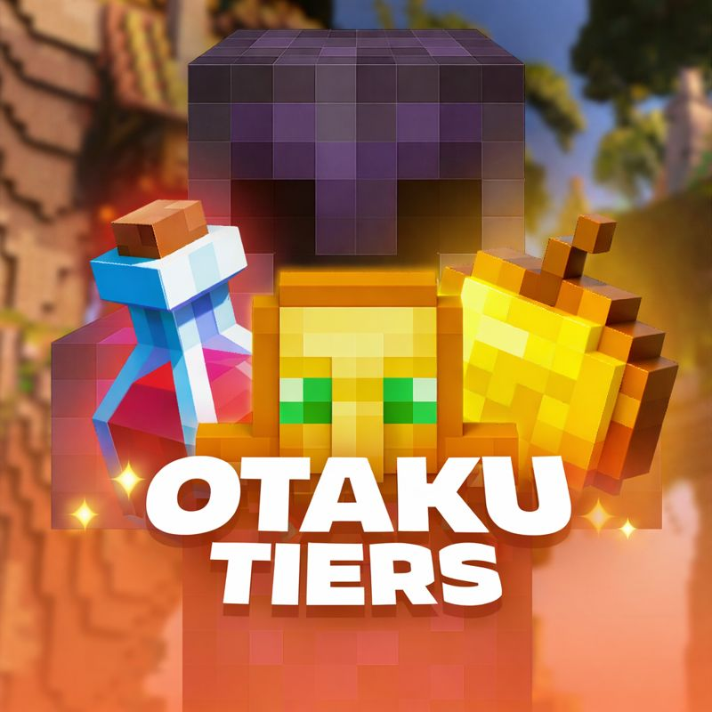

<!DOCTYPE html>
<html>
<head>
  <title>Otaku Tiers</title>
  <meta name="viewport" content="width=device-width, initial-scale=1.0">

  
</head>

<body>

<!-- OTAKU BANNER -->

  

<!-- SEARCH -->

  <input placeholder="Search player...">

<!-- PROFILE CARD -->

  

    
    

      
Player Name

      
NA • Combat Ace

    

  

  <!-- ALL GAMEMODE ICONS -->
  

    <!-- Crystal -->
    

      
      
HT1

    

    <!-- Sword -->
    

      
      
HT1

    

    <!-- Axe -->
    

      
      
LT1

    

    <!-- SMP -->
    

      
      
LT1

    

    <!-- Mace -->
    

      
      
HT1

    

    <!-- NethPot -->
    

      
      
HT1

    

    <!-- DiaPot -->
    

      
      
LT2

    

    <!-- UHC -->
    

      
      
HT2

    

  

</body>
</html>
